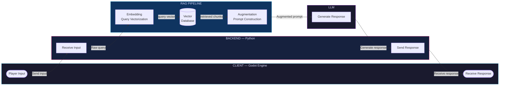

# Soulful NPC

Soulful NPC is a prototype of a 2D game where NPCs are powered by local LLM and Retrieval-Augmented Generation.

## Project Overview

Soulful NPC's main goal is to learn how to create a unique gaming experience by integrating local large language model with retrieval-augmented generation technique.

## Project Feature

- Dynamic NPC Dialogues: NPC generate response based on player's interaction, own knowledge, system prompt.
- Customizable Knowledge Base: Easily update the npc's and lore's knowledge base.
- All in local: All data, logics and interactions handled in local.

## Tech Stack

- Godot Engine 4.6: Using WebSocket to connect to ai 
- Python:
    - FastAPI: Hosting backend service in local and handling data transferation.
    - WebSocket: Create a bidirectional, real-time, continuous communication channel between Godot and Python.
    - LangChain: Handling context chunking, embedding, RAG logics.
    - Ollama: Running llm model locally.
- Database: ChromaDB.

## Workflow:

Create a bidirectional communication channel between Godot and Python.

Godot (Player input) --> Python Backend (Receive input) --> Embedding (Query vectorization) --> Retrieval (Retrieve vector database) --> Augmentation (Prompt construction)--> LLM (Generate response) --> Python Backend (Response) --> Godot (Receive response)

