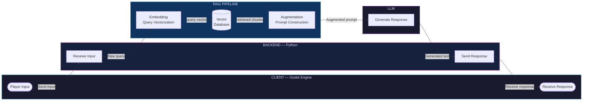

# Soulful NPC


> A 2D game prototype where NPCs are powered by local LLM and Retrieval-Augmented Generation (RAG), enabling dynamic, context-aware dialogues completely local.

> [!WARNING]
> This is a experimental project.
> If you encounter any problems, please try to solve them yourself.

---

## Project Overview

**Soulful NPC** is a project built for learning how LLM and RAG can be integrated into game to create more immersive NPC interactions. Not relying on scripted dialogue trees or routes. NPCs retrieve relevant knowledge from a local vector database then generate responses to player.

This project serves as a learning sandbox for building a full RAG pipeline, connecting game to local backend service, and designing a system that keeps all data and computation on local.

---

## Features

- **Dynamic NPC Dialogues** — NPCs generate responses based on player input, their own knowledge base, and a customizable system prompt.
- **Retrieval-Augmented Generation** — Each player query is vectorized and used to retrieve relevant context from a local vector database before being passed to the LLM.
- **Customizable Knowledge Base** — NPC personality data and world lore can be updated independently via the vector database without modifying game logic.
- **Fully Local** — All data, logic, and inference run on-device. No internet connection or external API is required.
- **Real-time Communication** — Bidirectional WebSocket connection between Godot and the Python backend enables low-latency, continuous dialogue.

---

## Tech Stack

| Layer           | Technology       | Purpose                                      |
| --------------- | ---------------- | -------------------------------------------- |
| Game Client     | Godot Engine 4.x | Player interaction, UI, WebSocket client     |
| Backend         | Python + FastAPI | REST/WebSocket server, request routing       |
| Communication   | WebSocket        | Real-time bidirectional messaging            |
| RAG Framework   | LangChain        | Text chunking, embedding, retrieval pipeline |
| Vector Database | ChromaDB         | Local vector storage and similarity search   |
| LLM Runtime     | Ollama           | Running LLMs locally (e.g. Llama 3, Mistral) |

---

## System Architecture

The system follows a request-response cycle initiated by the player:

```
Godot (Player Input)
  → Python Backend (Receive Input)
    → Embedding (Query Vectorization)
      → Retrieval (Vector Database Lookup)
        → Augmentation (Prompt Construction)
          → LLM (Generate Response)
        → Python Backend (Format Response)
  → Godot (Display Response)
```

The core of the interaction lies in similarity search within the vector space. Given a query vector $q$ and a document vector $d$, the system calculates:

$$score = \frac{q \cdot d}{|q| |d|}$$

The top-k results are then injected into the LLM system prompt as `context`.

**Here's the system diagram:**


---

## Project Structure

> Template

```
soulful-npc/
├── godot/                  # Godot project files
│   ├── scenes/             # Game scenes
│   └── scripts/            # GDScript files (WebSocket client, UI logic)
├── backend/                # Python backend
│   ├── main.py             # FastAPI entry point
│   ├── rag/                # RAG pipeline (embedding, retrieval, augmentation)
│   └── knowledge_base/     # Source documents for vector ingestion
├── requirements.txt
└── README.md
```

---

## Get started

### Requirements

- Download [Python 3.11+](https://www.python.org/).
- Download [Godot Engine 4.x+](https://godotengine.org/) editor.
- Download [Ollama](https://ollama.com/) app.

### Installation

1. **Clone the repository**
   
   ```bash
   git clone https://github.com/tdbbbfps/SoulfulNpc.git
   cd SoulfulNpc
   ```

2. **Install Python dependencies**
   
   ```bash
   pip install -r requirements.txt
   ```
  > [!TIP]
  > If you are using uv, use the following command.
  > ```bash
  > uv sync
  > ```

3. **Open and run the Godot project**
   
   Open project in Godot Editor and run main.tscn to start.
  > [!NOTE]
  > TODO: Export the game.

---

## Configuration

You can configure the following in `backend/config.py` (or via environment variables):

| Variable         | Default       | Description                             |
| ---------------- | ------------- | --------------------------------------- |
| `OLLAMA_MODEL`   | `llama3`      | The local LLM model to use via Ollama   |
| `CHROMA_DB_PATH` | `./chroma_db` | Path to the ChromaDB persistent storage |
| `WEBSOCKET_PORT` | `8765`        | Port for the WebSocket server           |
| `CHUNK_SIZE`     | `500`         | Token chunk size for document ingestion |

---

## Current Progress

- [ ] **Game Client (Godot)**
  - [ ] Player Controller
    - [ ] Components
      - [ ] Movement
      - [ ] Input Handler
      - [ ] Animation Handler
    - [ ] Finite State Machine
  - [ ] NPC
    - [ ] Interaction
  - [ ] Interaction System
    - [ ] Interaction Manager
    - [ ] Interactable Area
    - [ ] Interaction Menu
  - [ ] Dialogue System (using addons)
  - [ ] UI System (Dialogue Box, Chat Input)
    - [ ] Character Art and Name Display
    - [ ] Dialogue Box
    - [ ] Chat Input
  - [ ] WebSocket Client
- [ ] **Python Backend**
  - [ ] FastAPI Server Setup
    - [ ] App initialization
    - [ ] Configuration loading
  - [ ] WebSocket Endpoint
    - [ ] Connection Manager
    - [ ] Bidirectional messaging
  - [ ] Ollama
  - [ ] NPCs' Memories (Chat History)
- [ ] **RAG Pipeline**
  - [ ] Vector Database (ChromaDB)
    - [ ] Client setup & Persistence
  - [ ] Document Ingestion & Embedding
    - [ ] Document Loader
    - [ ] Text Chunking
    - [ ] Embedding Generation
  - [ ] Retrieval
    - [ ] Similarity Search
    - [ ] Prompt Template Construction

## Future Goals

- [ ] Support multiple NPCs with isolated knowledge bases.
- [ ] Add memory / conversation history.
- [ ] Emotion / mood system influencing how NPC will response.
- [ ] In-game tool for hot-reloading the knowledge base.

---

## License

This project is licensed under the [MIT License](LICENSE).

---

## Others

> [!CAUTION]
> This project is for learning and experimentation purposes.
> 
> *I don't know when I can finish this project.*
> 
> ~~I'll probably do a little bit and then abandon it.~~

```python
@app.get("/health")
async def health() -> dict:
  return {"message": "Still alive."}
```
